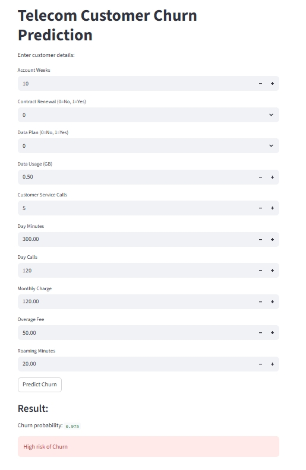

# Telecom Customer Churn Prediction (Streamlit App)

A machine learning web application that predicts the probability of customer churn using XGBoost and business-oriented threshold tuning.

##  Business Problem

Telecom companies face significant revenue loss due to customer churn.
The goal of this project is to identify customers who are likely to churn so that retention strategies (discounts, offers, customer engagement) can be applied proactively.

##  Dataset Overview

The dataset includes customer behavioral and usage features such as:
- AccountWeeks
- ContractRenewal
- DataPlan
- DataUsage
- CustServCalls
- DayCalls
- MonthlyCharge
- OverageFee
- RoamMins

Target Variable: Churn (0 = No, 1 = Yes)

The dataset is imbalanced, making PR-AUC an important evaluation metric.

##  Models Implemented

- Logistic Regression
- Random Forest
- XGBoost

XGBoost was selected as the final model based on superior ROC-AUC and PR-AUC performance.

##  Model Performance

- ROC-AUC: ~0.85
- PR-AUC: ~0.73
- Recall (after threshold tuning): 78%

##  Threshold Tuning Strategy
Instead of using the default 0.5 threshold, a threshold of 0.35 was applied.
Why?
In churn prediction:
- False Negatives (missed churn customers) are costly.
- Higher recall ensures more potential churn customers are identified.

This makes the model more aligned with business retention goals.

##  Live Demo

Click here to try the live app:  
[Open Streamlit App](https://telecom-churn-prediction-classification-app-kvqotesecxbmbegvp5.streamlit.app/e)

##  Application Preview

Below is the Streamlit web application interface:

##  How to Run Locally

1. Install dependencies
pip install -r requirements.txt
2. (Optional) Generate model file
AnalysisBook_Telecom_churn_Classification_Project.ipynb
3. Run the Streamlit app
streamlit run app.py

## Future Improvements

- Hyperparameter tuning (Optuna/GridSearch)
- Cross-validation evaluation
- Model explainability using SHAP
- Docker containerization

##  Conclusion

This project demonstrates:
- Handling imbalanced datasets
- Model comparison & evaluation
- Business-driven threshold tuning
- End-to-end ML pipeline
- Web app deployment using Streamlit

This project demonstrates a practical application of machine learning for real-world telecom customer retention strategy.